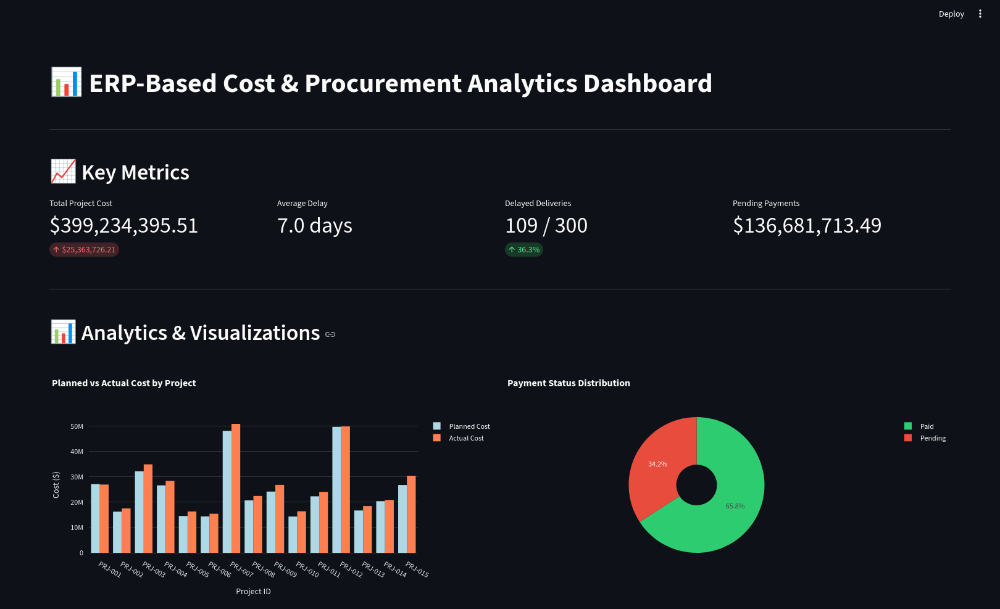

## Dashboard Preview



# ERP-Based Cost & Procurement Analytics Dashboard

A comprehensive Streamlit-based dashboard for infrastructure project management, simulating SAP-like ERP workflows for cost tracking, procurement, and billing analytics.

## Features

### 1. **Synthetic Data Generation**
- 300 rows of realistic infrastructure project data
- Multiple projects, vendors, and materials
- Realistic cost variations and delivery delays

### 2. **Data Columns**
- Project_ID
- Vendor_Name
- Material
- Quantity, Unit_Cost, Total_Cost
- Planned_Cost vs Actual_Cost
- Procurement_Date, Delivery_Date, Delay_Days
- Billing_Amount, Payment_Status
- Calculated: Cost_Variance, Cost_Overrun_Pct

### 3. **Interactive Dashboard**
**Sidebar Filters:**
- Project ID
- Vendor Name
- Payment Status

**Key Metrics:**
- Total Project Cost
- Average Delay
- Delayed Deliveries
- Pending Payments

### 4. **Visualizations**
- **Bar Chart**: Planned vs Actual Cost by Project
- **Pie Chart**: Payment Status Distribution
- **Line Chart**: Cumulative Cost Trend Over Time
- **Tables**: 
  - Top Vendors by Delay
  - Highest Cost Overruns by Material

### 5. **Insights & Analytics**
- Automated key performance indicators
- Project overview and delivery performance
- Vendor performance aggregation

### 6. **Decision Insights (AI-Powered Recommendations)**
- Vendor delay warnings
- Budget overrun alerts
- Payment processing recommendations
- Material cost variance analysis

## Installation

### Option 1: Using Virtual Environment (Recommended)

```bash
# Create virtual environment
python3 -m venv venv

# Activate virtual environment
source venv/bin/activate  # On Linux/Mac
# OR
venv\Scripts\activate  # On Windows

# Install dependencies
pip install streamlit pandas matplotlib plotly numpy
```

### Option 2: System-wide Installation

```bash
pip install streamlit pandas matplotlib plotly numpy
```

## Running the Application

```bash
# Make sure virtual environment is activated (if using venv)
source venv/bin/activate

# Run the Streamlit app
streamlit run app.py
```

The dashboard will open in your default browser at `http://localhost:8501`

## Usage

1. **Launch the app** using the command above
2. **Use sidebar filters** to focus on specific projects, vendors, or payment statuses
3. **View key metrics** at the top of the dashboard
4. **Explore visualizations** for cost trends and payment analysis
5. **Review tables** for vendor performance and cost overruns
6. **Read decision insights** for automated recommendations
7. **Download data** using the raw data section at the bottom

## Code Structure

```python
# Data Generation Functions
- generate_erp_data()          # Create synthetic dataset

# Data Processing Functions
- calculate_vendor_performance()  # Aggregate vendor metrics
- identify_top_overruns()        # Find cost overrun materials
- generate_insights()            # Calculate KPIs
- generate_decision_insights()   # AI recommendations

# Visualization Functions
- plot_planned_vs_actual()       # Bar chart
- plot_payment_status()          # Pie chart
- plot_cost_trend()              # Line chart

# Main Application
- main()                         # Streamlit app controller
```

## Key Features Explained

### Cost Variance Calculation
```python
Cost_Variance = Actual_Cost - Planned_Cost
Cost_Overrun_Pct = (Cost_Variance / Planned_Cost) * 100
```

### Vendor Performance Metrics
- Average Delay Days
- Total Cost
- Average Cost Variance
- Order Count

### Automated Recommendations
The system automatically identifies:
- Vendors with delays > 10 days
- Projects exceeding budget by > 15%
- High pending payment amounts
- Materials with highest cost variances

## Technology Stack

- **Streamlit**: Web application framework
- **Pandas**: Data manipulation and analysis
- **Plotly**: Interactive visualizations
- **Matplotlib**: Additional plotting capabilities
- **NumPy**: Numerical computations

## Sample Data Schema

| Column | Type | Description |
|--------|------|-------------|
| Project_ID | String | Project identifier (PRJ-001 to PRJ-015) |
| Vendor_Name | String | Supplier company name |
| Material | String | Construction material type |
| Quantity | Integer | Ordered quantity |
| Unit_Cost | Float | Cost per unit |
| Total_Cost | Float | Quantity × Unit_Cost |
| Planned_Cost | Float | Budgeted cost |
| Actual_Cost | Float | Real cost incurred |
| Procurement_Date | Date | Order date |
| Delivery_Date | Date | Actual delivery date |
| Delay_Days | Integer | Delivery delay in days |
| Billing_Amount | Float | Invoice amount |
| Payment_Status | String | Paid/Pending |
| Cost_Variance | Float | Actual - Planned |
| Cost_Overrun_Pct | Float | Variance percentage |

## Customization

To modify the data generation:
- Edit `num_rows` parameter in `generate_erp_data()` (default: 300)
- Add/remove projects, vendors, or materials in the reference lists
- Adjust delay probability distribution
- Modify cost variance ranges

## License

This is a demonstration project for ERP analytics dashboard implementation.

---

**Built with ❤️ using Streamlit**
